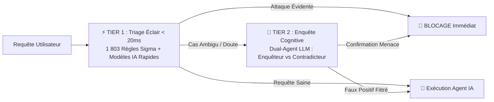

# 🛡️ Vinci ADR — Guide Exécutif & Intégration pour Vinci Logic

> **Document de synthèse pour la direction technique**  
> *Projet : Sécurisation et garde du corps temps réel pour l'Assistant IA Vinci Logic*

---

## 🌟 1. En Bref : Qu'est-ce que Vinci ADR ?

**Vinci ADR** (*Agent Detection & Response*) est un **pare-feu intelligent de nouvelle génération** conçu spécifiquement pour protéger les agents IA et les modèles de langage (LLMs).

Tout comme un **EDR** protège un ordinateur contre les virus, **Vinci ADR** se place autour de l'assistant IA pour intercepter et neutraliser les attaques en temps réel à **3 niveaux clés** :

```
[ Utilisateur ] ──( 1. Entrée )──► [ Assistant IA ] ──( 2. Outils / APIs )──► [ Système / BDD ]
                                          │
                                     ( 3. Sortie )
                                          ▼
                                   [ Réponse Client ]
```

1. **À l'Entrée** : Bloque les *prompt injections*, jailbreaks et tentatives de manipulation (même obfusquées en Base64 ou caractères cachés).
2. **À l'Exécution des Outils** : Empêche l'agent d'exécuter des actions destructrices ou non autorisées (suppression de données, exfiltration réseau).
3. **À la Sortie** : Caviarde automatiquement les mots de passe / clés d'API qui fuiraient (DLP) et vérifie que le code généré est sans failles (Top 25 CWE).

---

## 🏛️ 2. Comment ça fonctionne ? (L'Architecture en 2 Niveaux)

Pour être à la fois **ultra-rapide** et **intelligent**, Vinci ADR utilise une architecture à double niveau inspirée des travaux de recherche d'**Uber ADR (MLSys 2026)** :



* **⚡ Tier 1 (Triage Éclair < 20 ms)** : 
  Vérification instantanée par **1 803 règles de détection comportementale** (Sigma MITRE ATT&CK + Sage), scanner de secrets (210 patterns Gitleaks) et modèles de classification légers (ModernBERT, DeBERTa).
* **🧠 Tier 2 (Enquête Cognitive sur cas ambigus)** : 
  Si une requête ressemble à une attaque mais pourrait être légitime, elle est analysée par **deux agents IA contradictoires** (*Forensic Analyst* qui cherche la faille, et *Critic Agent* qui élimine les faux positifs).

---

## 🔌 3. Comment l'intégrer à un Agent existant ?

L'intégration a été conçue pour être **Plug & Play** (non intrusive). Elle s'ajoute en quelques lignes de code Python sans modifier la logique existante de l'agent.

### Étape A : Valider le message utilisateur (Entrée)

```python
from vinci_adr import VinciADREngine, EngineConfig, SensitivityPreset, ActionDecision

# Initialisation du moteur
engine = VinciADREngine(EngineConfig(sensitivity=SensitivityPreset.BALANCED))

# Validation avant d'appeler l'agent
verdict = engine.evaluate(user_prompt)

if verdict.verdict.decision == ActionDecision.BLOCK:
    return "🚨 Requête bloquée par la politique de sécurité Vinci ADR."
```

### Étape B : Protéger les outils de l'agent (Mode Daemon)

Pour empêcher un agent d'exécuter une commande dangereuse si un utilisateur parvient à le manipuler :

```python
from vinci_adr import VinciDaemon, DaemonConfig

daemon = VinciDaemon(DaemonConfig())

# On applique simplement le décorateur sur les fonctions / outils de l'agent
@daemon.wrap_tool
def executer_commande_systeme(commande: str):
    # Exécution standard...
    pass

# Si l'agent tente d'exécuter 'rm -rf' ou une exfiltration, Vinci ADR bloque l'appel instantanément
```

*(Support natif inclus pour les serveurs d'outils **MCP - Model Context Protocol** et **LangChain**).*

### Étape C : Sécuriser la réponse finale (Sortie & DLP)

```python
from vinci_adr import OutputGuardEngine

guard = OutputGuardEngine()
resultat = guard.scan_output(reponse_llm)

# Les clés d'API ou mots de passe sont automatiquement caviardés en [REDACTED_SECRET]
reponse_client = resultat.sanitized_text
```

---

## 🎯 4. Adaptations Spécifiques au Contexte Vinci Logic (SOC / Cyber)

Comme **Vinci Logic** développe un assistant dans le domaine de la **Cybersécurité / SOC**, les utilisateurs vont légitimement soumettre des logs suspects, des règles Sigma ou des scripts d'attaques à analyser. 

Voici ce que l'équipe technique doit adapter :

| Élément à adapter | Pourquoi ? | Action concrète |
|---|---|---|
| **1. Profil de Sensibilité** | Éviter de bloquer un analyste SOC qui colle du code malveillant pour l'étudier | Configurer `SensitivityPreset.BALANCED` ou `RELAXED` (permet au Tier 2 d'analyser le contexte au lieu de bloquer brutalement). |
| **2. Whitelist des Outils SOC** | Autoriser les outils d'investigation légitimes de Vinci Logic | Déclarer la liste des outils autorisés dans `DaemonConfig(allowed_tools=["query_threat_intel", "search_cve", "read_logs"])`. |
| **3. Secrets Métier (DLP)** | Masquer les clés internes propres à Vinci Logic | Ajouter les patterns d'API keys internes (tokens SIEM, clés VirusTotal/Shodan) dans `SecretsScanner`. |
| **4. Contexte Prompt Tier 2** | Informer l'IA d'enquête du rôle de l'assistant | Ajuster le prompt système de l'enquêteur (`prompts.py`) : *"L'utilisateur est un analyste de sécurité habilité..."*. |
| **5. Clé LLM / Modèle Souverain** | Alimenter le Tier 2 en conformité RGPD / Souveraineté | Configurer la clé Gemini / Claude dans le `.env` ou pointer vers un modèle local hébergé on-premise chez Vinci Logic. |

---

## 📊 5. Chiffres Clés & Garanties de Sécurité

* **🎯 100% de Taux de Blocage (Rappel)** : Validé sur le benchmark international d'attaques réelles **DEF CON 31 AI Village**.
* **⚡ Vitesse d'Exécution** : **< 20 ms** au Tier 1 (invisible pour l'utilisateur).
* **🛡️ 1 803 Règles Comportementales** : Couverture standardisée selon la matrice **MITRE ATT&CK** et SigmaHQ.
* **🧪 238 Tests Automatisés (100% Succès)** : Codebase robuste, typée (Pydantic v2) et documentée.
* **📦 Dépôt GitHub Officiel** : [github.com/Ayanoh/Vinci-ADR](https://github.com/Ayanoh/Vinci-ADR)

---

## 🚀 Synthèse Décisionnelle

> **Vinci ADR** apporte à l'assistant IA de Vinci Logic une **couche de sécurité d'entreprise prête pour la production**, qui protège à la fois nos serveurs et les données de nos clients, tout en conservant une expérience utilisateur fluide et sans ralentissement.
