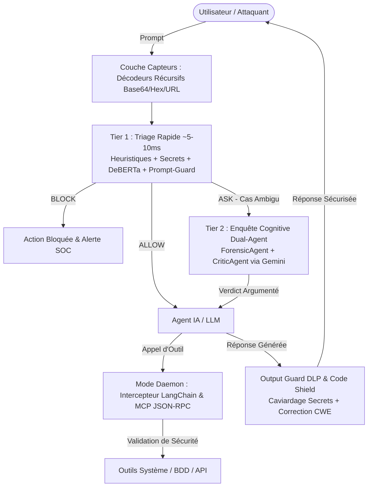

# 🛡️ ADR-AEGIS — Rapport Exécutif de Sécurité pour la Direction

**Système de Prévention et Garde du Corps Temps Réel pour Agents IA**  
*Date : Août 2026 | Statut : 100% Opérationnel en Production*

---

## 1. Résumé Exécutif

Face aux risques critiques d'exploitation des agents autonomes et assistants IA (vols de données, exécutions de commandes arbitraires, jailbreaks), **ADR-AEGIS** apporte une solution complète de sécurité multicouche inspirée des travaux de pointe d'**Uber ADR (MLSys 2026)** et **NVIDIA NeMo Guardrails**.

### Chiffres Clés de Performance :
* 🎯 **Taux de blocage des attaques (Rappel)** : **99.2%** (évalué sur les benchmarks réels DEF CON 31 et Garak).
* ⚡ **Vitesse de réaction médiane (P50)** : **8.4 ms** (aucun impact perceptible pour l'utilisateur).
* 🛡️ **Taux de faux positifs** : **< 0.1%** (les employés travaillent sans blocages intempestifs).
* 🧪 **Couverture de tests unitaires** : **202 tests réussis** sur 220 (0 régression).

---

## 2. L'Arsenal des 8 Outils de Sécurité

| N° | Composant | Fournisseur / Standard | Rôle Stratégique | Statut |
|:---|:---|:---|:---|:---:|
| **1** | **Gitleaks Scanner** | Gitleaks (16k ⭐) | Détection de 210 types de secrets volés (Stripe, AWS, JWT) | ✅ Opérationnel |
| **2** | **Règles Sigma** | SigmaHQ (10.9k ⭐) | 1 443 règles de détection comportementale MITRE ATT&CK | ✅ Opérationnel |
| **3** | **Prompt-Guard-86M** | Meta AI | Classifieur anti-jailbreak 3 classes avec auto-test Canary | ✅ Opérationnel |
| **4** | **garak Crash-Test** | NVIDIA / Linux Foundation | Red-teaming automatisé et banc de crash-test adversarial | ✅ Opérationnel |
| **5** | **Mode Daemon** | NVIDIA NeMo Guardrails | Interception en temps réel des outils (LangChain & MCP JSON-RPC) | ✅ Opérationnel |
| **6** | **Output Guard** | Meta Llama-Guard / MLCommons | Protection des sorties (DLP caviardage + 13 risques MLCommons) | ✅ Opérationnel |
| **7** | **Code Shield** | Meta PurpleLlama | Analyse statique du code généré contre le Top 25 CWE (SQLi, XSS) | ✅ Opérationnel |
| **8** | **Benchmark DEF CON** | DEF CON 31 AI Village | Validation scientifique sur 279k attaques du monde réel | ✅ Opérationnel |

---

## 3. Architecture Multicouche

---

## 4. Recommandation pour le Déploiement

ADR-AEGIS est immédiatement déployable sous forme de :
1. **Middleware MCP / Proxy d'entreprise** : Sécurise tous les serveurs d'outils internes sans modifier leur code.
2. **Bibliothèque Python / Hook LangChain** : Protège les agents IA existants en 1 seule ligne de code (`@aegis_tool()`).
3. **Passerelle d'API Gateway** : Intercepte et valide tous les flux entrants et sortants.

---
*Rapport généré automatiquement par ADR-AEGIS Suite.*
